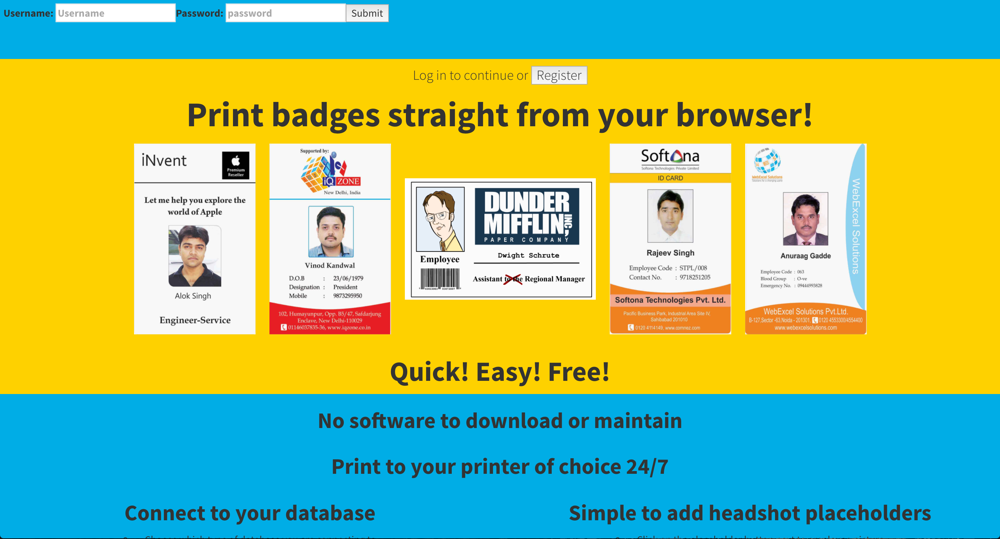
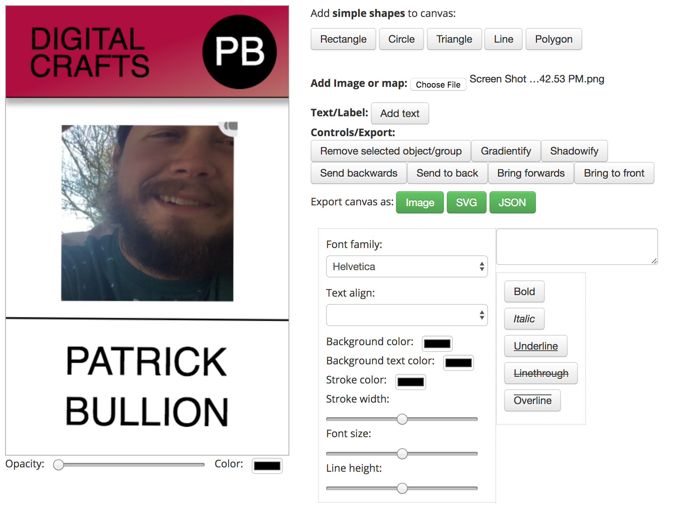
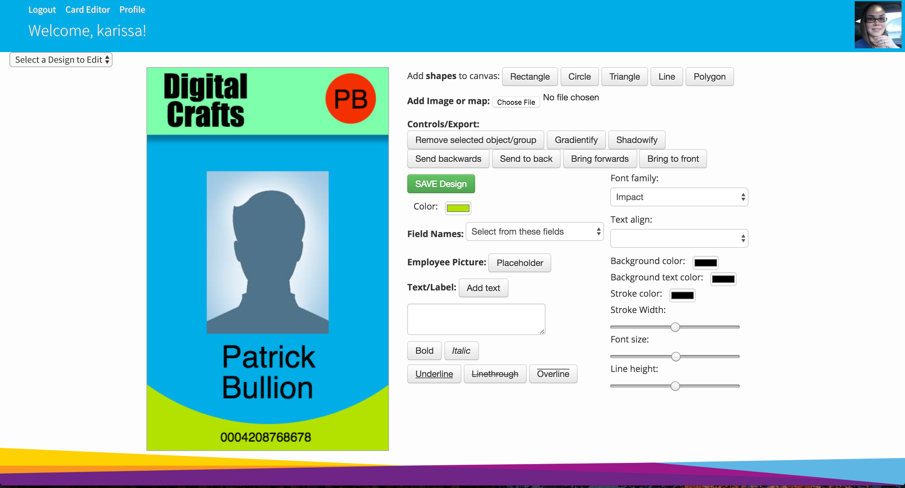

#Badge Design Online 
This was built as a full-stack project for DigitalCrafts. 

www.badgedesignonline.com

##Contents
  * Overview 
  * Technologies
  * Challenges and Solutions 
  * MVP 
  * Stretch Goals
  * Contributors 

##Overview 
Badge Design Online is an online solution to printing your companies badge's using your database.  Once on our website you can connect your mySQL database with your employee fields.  Once connected to your database you can create a template to be able to populate your template and batch print your badges.  Once you create a template you can save them for use later as needed for new employee's or lost badges.

##Video Demonstration
[Card Editor](https://www.badgedesignonline.com/readmefiles/readme1.mov)

##Technologies 
The following technologies and APIs were used:
  * HTML
  * CSS
  * Bootstrap
  * jQuery
  * Javascript
  * ReactJS
  * AngularJS
  * PostGreSQL/PyGreSQL
  * mySQL

##Challenges and Solutions
 
1.  Finding the right way to print the badges once created.
 
 
2.  Creating the card editor.
  * One of the big needs for the site was the ability to be able to design and edit the badge templates.  Having a way to create and edit the cards is the basis of the site.  We found several npm modules that looked promising but it took abit of searching to find one that had all the tools we would need for editing the cards.  We found a really good one that we were able to make our own and add several features too.  Users are able to add multiple shapes, text, and add gradients and shadow effects as well to each.

From the example above you can see what the editor looked like after a day of working on it.  The top is a rectangle that we changed the color, added a gradient effect, added text, and then put a circle with some text in the circle. Having this we knew we were on our way.

This is what the card editor looks like now.
3.  We had trouble connecting the iframe with the editor back to the actual main page.
  * We had to figure out exactly how to send data back and forth from the database to the iframe to be able to populate the column fields people may want on the site.  We fixed this issue by passing in the database results into the iframe url and were able to pull them using jQuery inside the iframe.

4.  Rain and flooding
Our first day working on the project was pretty crazy with the monsoon that came through Houston, leaving half the group unable to come in.  So the project got off to a slow start.

##MVP
Our goal starting out was to build a completely functional badge printing website that not only prints a single badge but has the ability to print a whole batch of badges from a database, drastically cutting down on time spent by someone printing tons of employee badges.  No website had the ability to connect your company database and populate the badges using your own template.
    * Professional looking front end website
    * Login/Logout features that allow users to save templates into their profile for use at a later time.
    * The ability to connect to PostgreSQL and mySQL
    * Card editor that allows for shapes, text, images, and placeholders for employee pictures, names, titles, etc.

##Stretch Goals 
We met several of our stretch goals
  * We were able to add a second database connection for PostgreSQL
  * Users can save templates with access to the saved templates in their profile
We still plan on implementing these strectch goals
  * landscape badges (you can do them but just they are sideways)
  * We were unable to get to letting users print on the back of the badges
  * Allow elements to be conditionally printed

##Contributors 

  * Karissa Martin
  * Patrick Bullion

